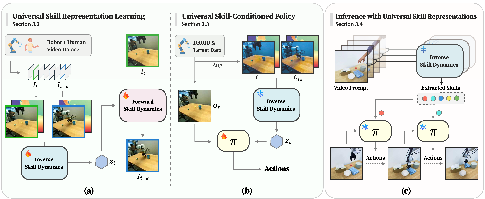
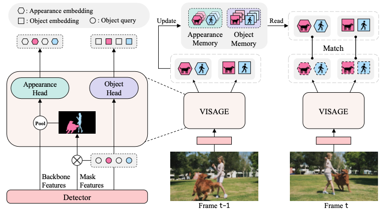
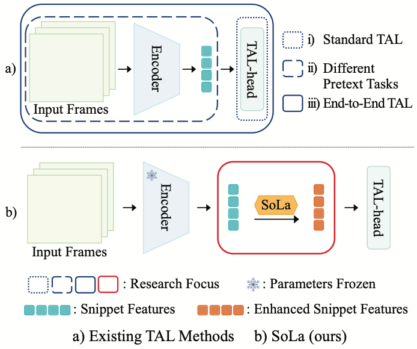

`* indicates equal contribution.`

  

    

      
  

  

    

      <b> UniSkill: Imitating Human Videos via Cross-Embodiment Skill Representations </b> 
       <b>Hanjung Kim$^*$</b>, Jaehyun Kang$^*$, Hyolim Kang, Meedeum Cho, Seon Joo Kim, Youngwoon Lee   
       <b>CoRL 2025</b>   
      
        <a href="https://kimhanjung.github.io/UniSkill/">[Project]</a>
        <a href="https://arxiv.org/pdf/2505.08787">[Paper]</a>
        <a href="https://github.com/KimHanjung/UniSkill">[Code]</a>
      
    

  

 

  

    

      

      
      

  

  

    

      <b> A Training-Free, Task-Agnostic Framework for Enhancing MLLM Performance on High-Resolution Images </b> 
       Jaeseong Lee$^*$, Yeeun Choi$^*$, Heechan Choi$^*$, <b>Hanjung Kim</b>, Seon Joo Kim   
       <b>CVPRW 2025</b> 
       2nd Workshop on Emergent Visual Abilities and Limits of Foundation Models Workshop 
      
        <a href="https://arxiv.org/pdf/2507.10202">[Paper]</a>
      
    

  

 

  

    

      
  

  

    

      <b> VISAGE: Video Instance Segmentation with Appearance-Guided Enhancement </b> 
       <b>Hanjung Kim</b>, Jaehyun Kang, Miran Heo, Sukjun Hwang, Seoung Wug Oh, Seon Joo Kim   
       <b>ECCV 2024</b>   
      
        <a href="https://kimhanjung.github.io/VISAGE/">[Project]</a>
        <a href="https://arxiv.org/pdf/2312.04885.pdf">[Paper]</a>
        <a href="https://github.com/KimHanjung/VISAGE">[Code]</a>
      
    

  

 

  

    

      
  

  

    

      <b> Soft-Landing Strategy for Alleviating the Task Discrepancy Problem in Temporal Action Localization Tasks </b> 
       Hyolim Kang, <b>Hanjung Kim</b>, Joungbin An, Minsu Cho, Seon Joo Kim   
       <b>CVPR 2023</b>  
       Finalist at Qualcomm Innovation Fellowship 2023  
      
        <a href="https://openaccess.thecvf.com/content/CVPR2023/papers/Kang_Soft-Landing_Strategy_for_Alleviating_the_Task_Discrepancy_Problem_in_Temporal_CVPR_2023_paper.pdf">[Paper]</a>
        <a href="https://github.com/musicalOffering/sola">[Code]</a>
      
    

  

 

    

    

  

    <b> A Generalized Framework for Video Instance Segmentation </b>  
     Miran Heo, Sukjun Hwang, Jeongseok Hyun, <b>Hanjung Kim</b>, Seoung Wug Oh, Joon-Young Lee, Seon Joo Kim   
     <b>CVPR 2023</b>   
    
      <a href="https://openaccess.thecvf.com/content/CVPR2023/html/Heo_A_Generalized_Framework_for_Video_Instance_Segmentation_CVPR_2023_paper.html">[Paper]</a>
      <a href="https://github.com/miranheo/GenVIS">[Code]</a>
    

  

