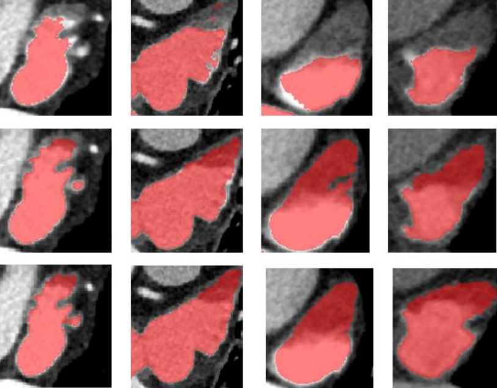
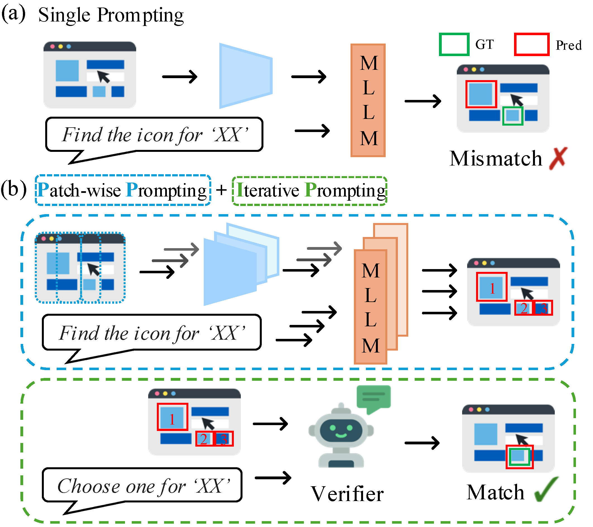
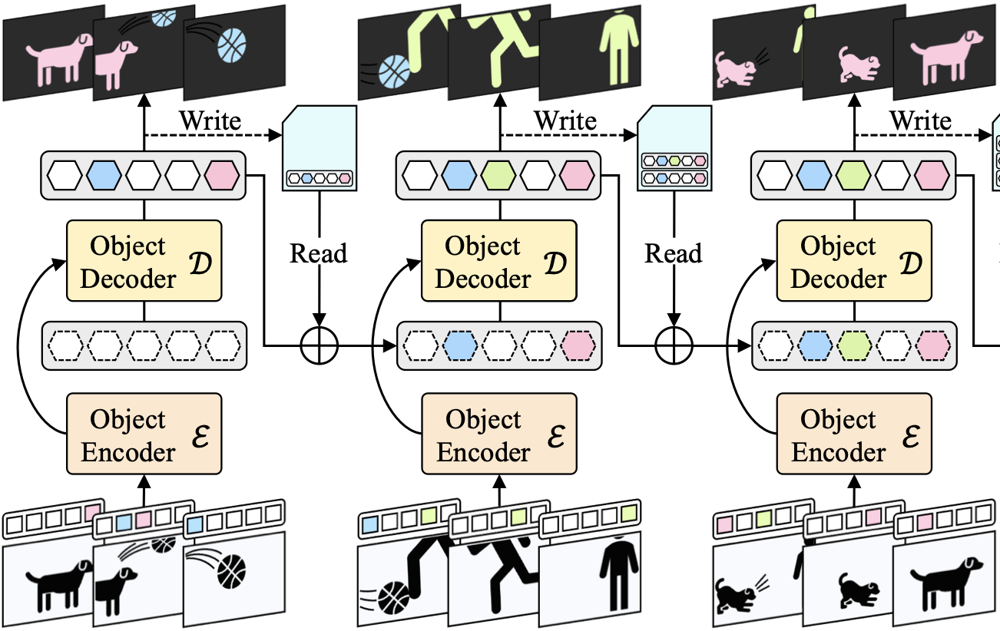

`* indicates equal contribution.`

  

    

      
  

  

    

      <b> 강화학습기반 불완전 조영 좌심방이 전자동 지역화 및 분할 기법 </b> 
       <b>Sojeong Kim$^*$</b>, Jongum Yoon$^*$, Byunghwan Jeon   
       <b>IPIU 2025</b>   
      
        <a href="https://">[Project]</a>
        <a href="../files/IPIU2025.pdf" target="_blank">[Paper]</a>
        <a href="https://">[Code]</a>
      
    

  

 

<!--

  

    

      

      
      

  

  

    

      <b> A Training-Free, Task-Agnostic Framework for Enhancing MLLM Performance on High-Resolution Images </b> 
       Jaeseong Lee$^*$, Yeeun Choi$^*$, Heechan Choi$^*$, <b>Hanjung Kim</b>, Seon Joo Kim   
       <b>CVPRW 2025</b> 
       2nd Workshop on Emergent Visual Abilities and Limits of Foundation Models Workshop 
      
        <a href="https://arxiv.org/pdf/2507.10202">[Paper]</a>
      
    

  

 

    

    

  

    <b> A Generalized Framework for Video Instance Segmentation </b>  
     Miran Heo, Sukjun Hwang, Jeongseok Hyun, <b>Hanjung Kim</b>, Seoung Wug Oh, Joon-Young Lee, Seon Joo Kim   
     <b>CVPR 2023</b>   
    
      <a href="https://openaccess.thecvf.com/content/CVPR2023/html/Heo_A_Generalized_Framework_for_Video_Instance_Segmentation_CVPR_2023_paper.html">[Paper]</a>
      <a href="https://github.com/miranheo/GenVIS">[Code]</a>
    

  

-->
