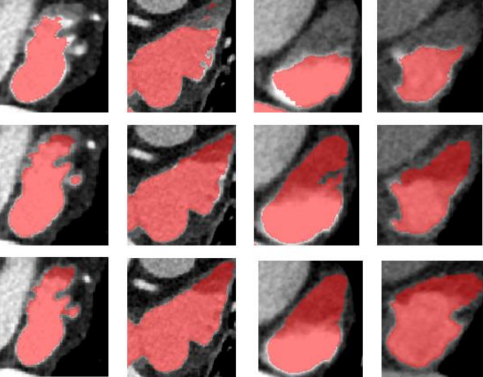

`* indicates equal contribution.`

  

    

      
  

  

    

      <b> 강화학습기반 불완전 조영 좌심방이 전자동 지역화 및 분할 기법 </b> 
       <b>Sojeong Kim$^*$</b>, Jongum Yoon$^*$, Byunghwan Jeon  
       <b>IPIU 2025</b>   
      
        <a href="https://kimhanjung.github.io/UniSkill/">[Project]</a>
        <!--
        <a href="https://arxiv.org/pdf/2505.08787">[Paper]</a>
        <a href="https://github.com/KimHanjung/UniSkill">[Code]</a>
        -->
      
    

  

 
